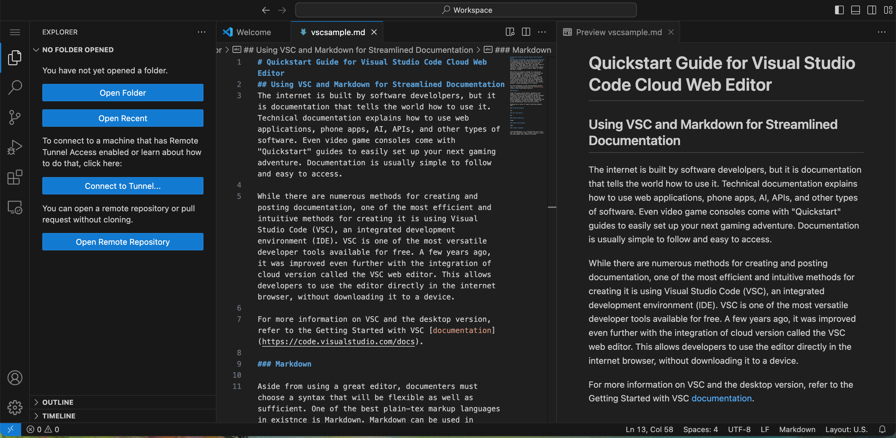

# Quick Start Guide for Visual Studio Code Cloud Web Editor
## Using VSC and Markdown for Streamlined Documentation

This article is intended for those with foundational information about coding, documentation, markup languages, and source control. If you'd like to skip to the part you need most, refer to the TOC below:

- [Markdown](#markdown)
- [Cloud Environments](#cloud-environments)
- [VSC Cloud Editor](#vsc-cloud-editor)
- [GitHub Integration](#github-integration)
- [Sample Code Snippets](#sample-code-snippets)


The Internet is built by software develolpers, but it is documentation that tells the world how to use it. Technical documentation explains how to use web applications, phone apps, AI, APIs, and other types of software. Even video game consoles come with "Quick Start" guides to easily set up your next gaming adventure. Documentation is usually simple to follow and easy to access. 

This article will discuss using Markdown and the Visual Studio Code (VSC) cloud environment to create detailed, quick, and effective documentation.  

### Markdown

Aside from using a great editor, documenters must choose a syntax that is flexible and sufficient. One of the best plain-text markup languages is Markdown. Markdown can be used in editors like VSC and as docs-as-code. While developers create changes and push code to the repository, writers can access, update, and release documentation faster and with accuracy. 

Markdown is a series of simple formatting elements that denote or signal the details of your text. For example, the "#" sign denotes a heading. All of Markdown's elements are keyboard-friendly, making for faster writing. Below is a quick cheat sheet of commonly used formatting elements:

- "#": heading
- "##": sub-heading
- "**": bold
- ">": italicized block quote
- "-": bullet points

For more Markdown syntax, check out the official [Markdown Cheat Sheet](https://www.markdownguide.org/cheat-sheet/).  

### Cloud Environments

When people hear "cloud," they often become intimidated or confused. A digital cloud environment refers to data or information that is stored digitally rather than on a hard drive like a laptop. For example, when you log into Instagram, all of its data, such as pictures, messages, and posts, is not stored on your phone; the information is stored online via servers. Many people come together to post, interact, and share events in one place—the Instagram cloud. 

Working on documentation or coding in a cloud environment has the same principles. Many people can come together to work in one place online while sharing and expanding information. Clouds can be used for massive apps like Instagram or singular projects and storage. 

### VSC Cloud Editor

While numerous methods exist for creating and posting documentation, one of the most efficient and intuitive methods is using Visual Studio Code, an integrated development environment (IDE). VSC is one of the most versatile developer tools available for free. A few years ago, it advanced even further by integrating a cloud version called the VSC web editor. This allows developers to use the editor directly in the web browser without downloading it to a device. 

For more information on VSC and the desktop version, refer to the Getting Started topic with VSC [documentation](https://code.visualstudio.com/docs). 

The VSC web editor can be used simply by going to [vscode.dev](https://vscode.dev). It opens in the browser, and you can begin immediately. Created folders and files are stored locally on the user's desktop or laptop. This allows the user to edit code or documentation in the cloud without downloading the VSC app. Older laptops or those with little storage can easily use the web-based version of the app. 


### GitHub Integration

Connecting your documentation to your GitHub repository is painless and quick. Follow the steps below to connect your VSC web editor to an existing repository (repo). 

**NOTE: If you do not have an existing repo in GitHub, you will need to create one to use this method to connect. For more information on starting a repo, refer to the [GitHub Getting Started Guide](https://docs.github.com/en/get-started).**

1. Navigate to your GitHub repository's main page. 
2. Remove the "https://" from the url.
3. Finally, replace the removed text with "vscode.dev/" and click "enter".

The browser will open your VSC web editor with your repo connect. 

 

Once connected to your repo, you can commit, push, and pull to your repo. 

One of the most significant differences between the desktop VSC and the cloud version is the absence of the terminal. So, when making commits and changes, you can only use the VSC options. 

To commit a change: 

1. Select the source control icon in the left-hand menu. 
2. In the "Message" field, add the commit notes.
3. Select the checkmark or click "Commit & Push" to commit changes to the desired repo.


### Sample Code Snippets

Developers' or end users' documentation often needs code snippets for examples and instructions. Markdown and VSC have special formatting for code. Using ``` at the beginning and end of text creates a code snippet. See the example below.  

```
from django.conf.urls import url

from . import views

urlpatterns = [
    url(r'^$', views.index, name ="index"),

    url(r'^allquotes$', views.allquotes, name ="allquotes"),
    url(r'^create/$', views.create, name='create'),
    url(r'^login/$', views.login, name="login"),
    url(r'^addquote$', views.addquote, name='addquote'),
    url(r'^likes$', views.likes, name='likes'),
    url(r'^edit$', views.edit, name='edit'),
    url(r'^(?P<id>\d+)/userquotes/$', views.userquotes, name ="userquotes"),
    url(r'^(?P<id>\d+)/myaccount/$', views.myaccount, name ="myaccount"),
    url(r'^(?P<id>\d+)/delete/$', views.delete, name='delete'),
    url(r'^logout/$', views.logout, name='logout'),
]
```
Using a code snipped within the documentation lets users to directly copy the code from the page. It creates a shortcut that helps work stay continuous and avoids redirecting the reader. 

### Closing (tl;dr)

VSC web editor or cloud version is one of the best free tools for coding and documentation. It directly connects to any Github repo and has nearly the same functions as the app's desktop version. While it does not have a terminal, it can be used on almost any device with an Internet connection. Combining VSC with Markdown creates a working environment that users can utilize as docs-as-code and work in tandem with developers. Documentation moves faster, is accurate, up-to-date, and functional with the fused functionality of an easy syntax language and a versatile code editor. 

To view the Markdown syntax for this documentation, open the .md file and select "Raw." 
