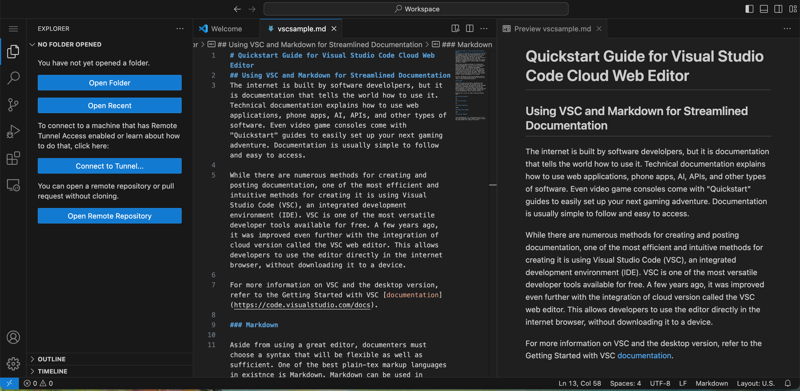

# Quickstart Guide for Visual Studio Code Cloud Web Editor
## Using VSC and Markdown for Streamlined Documentation

If you'd like to skip to the part you need most, refer to the TOC below:

- [Markdown](#markdown)
- [Cloud Environments](#cloud-environments)
- [VSC Cloud Editor](#vsc-cloud-editor)
- [Github Integration](#github-integration)
- [Sample Code Snippets](#sample-code-snippets)
- [Terminal Commands](#terminal-commands)

The internet is built by software develolpers, but it is documentation that tells the world how to use it. Technical documentation explains how to use web applications, phone apps, AI, APIs, and other types of software. Even video game consoles come with "Quickstart" guides to easily set up your next gaming adventure. Documentation is usually simple to follow and easy to access. 

This article will address using Markdown and the Visual Studio Code cloud environment for creating detailed, quick, and effecitve documentation. 

### Markdown

Aside from using a great editor, documenters must choose a syntax that will be flexible as well as sufficient. One of the best plain-tex markup languages in existnce is Markdown. Markdown can be used in editors like VSC, and can be used as docs-as-code. While developers are creating changes and pushing code to the repository, writers can access, update, and release documentation faster and with accuracy. 

Markdown has a series of simple formatting elements that denote or signal the details of your text. For example the "#" sign is used to denote a heading. All of Mardown's elements are keyboard friendly, making for faster writing. Below is a quick cheat sheet of commonly used formatting elements: 

- "#" : heading
- "##": sub-heading
- "**": bold
- ">": italicized block quote
- "-": bullet points

For more Markdown syntax, check out the official [Markdown Cheat Sheet](https://www.markdownguide.org/cheat-sheet/).  

### Cloud Environments

When people hear "cloud" they often become intimidated or confused. A digital cloud environment refers to data or information that is stored digitally versus on a hardrive like a laptop. For example, when you log into Instagram, all of its data such as pictures, messages, and posts are not stored on your phone; the information is stored online via servers. Many people come together to post, interact, and share events in one place—the Instagram cloud. 

Working on documentation or coding in a cloud environment has the same principles. Many people can come together to work in one place online while sharing and expanding information. Clouds can be used for massive apps like Instagram, or they can be used for singular projects and storage. 

### VSC Cloud Editor

While there are numerous methods for creating and posting documentation, one of the most efficient and intuitive methods for creating it is using Visual Studio Code (VSC), an integrated development environment (IDE). VSC is one of the most versatile developer tools available for free. A few years ago, it was improved even further with the integration of cloud version called the VSC web editor. This allows developers to use the editor directly in the internet browser, without downloading it to a device. 

For more information on VSC and the desktop version, refer to the Getting Started with VSC [documentation](https://code.visualstudio.com/docs). 

VSC web editor is used simply by going to [vscode.dev](vscode.dev). It opens in the browser and you can begin immediately. Files created are stored locally on the user's desktop or laptop. This allows the user to edit code or documentation in the cloud without downloading the VSC app. Older laptops or those with little storage can use the web based version of the app with ease. 

### Github Integration

video

### Sample Code Snippets

kjkh

### Terminal Commands 

The biggest difference between the web editor and the desktop version. 

cloud documentation, vsc, cloud tech and vsc for the web, easy integration video, images of github, explain how code smaples look, explain no terminal 